# Jornada Python da Hashtag Treinamentos, Abril 2025
**Duração: 8h - Certificado concedido por: CNPJ 26.344.392/0001-08**
## 🚀 Projetos e códigos desenvolvidos

## ⚙️ 1. Projeto de Automação
**Descrição:** Este projeto consiste em acessar um site (criado especialmente para fins didáticos), realizar login e cadastrar automaticamente diversos produtos. A automação simula a atuação humana em tarefas repetitivas, controlando o mouse e o teclado para executar todas as etapas do processo.

**Ao rodar o programa vamos ter as seguintes ações:**

✔️ Abrir o navegador

✔️ Acessar o site do sistema com login e senha

✔️ Inserir todas as informações do produto

✔️ Enviar as informações para o sistema

✔️ Repetir o cadastro até acabar o cadastro de todos os produtos

**Principais resultados:** Automação do processo de cadastro de milhares de produtos no Sistema usando Python para ser executado de forma diária e sob demanda.

## 📊 2. Projeto de Análise de Dados

**Descrição:** Este projeto consiste na análise de uma base de dados de clientes para identificar o percentual e os principais motivos de cancelamento. Com base nessas informações, foram propostas soluções estratégicas para reduzir esse índice e oferecer insights que auxiliem na tomada de decisões da empresa.

**Tratamento dos dados:**

✔️ Remoção de registros com informações vazias

✔️ Correção e padronização de dados inconsistentes

**Análise de Dados:**

✔️Verificação da taxa de cancelamento

✔️Análise dos contratos e identificação de padrões

✔️Identificação do impacto de contratos mensais no cancelamento

✔️Análise de assinaturas

✔️Análises gráficas

**Principais resultados:** Análise de cancelamento de clientes com gráficos e dashboards em Python para identificar as principais causas de cancelamento e possíveis ações de melhoria que reduziriam a taxa de 56% para 18%.

## 🤖 3. Projeto de Inteligência Artificial
**Descrição:** Este projeto consiste na análise do score de clientes de um banco. Uma base de dados com informações de 100.000 clientes foi utilizada com o objetivo de verificar a pontuação de cada um e identificar se é um bom cliente ou não. Isso permite ao banco decidir sobre a concessão de crédito, empréstimos e outros benefícios. O foco do projeto foi realizar o tratamento da base de dados, treinar algoritmos de classificação e avaliar qual modelo apresenta o melhor desempenho.

**Passos:**

✔️ Importar a base de dados

✔️ Tratamento dos dados:

	* Verificar informações vazias

	* Fazer o tratamento na base de dados

	* Selecionar as colunas de treino para o modelo

✔️ Treinar 2 modelos

✔️ Verificar o melhor modelo

✔️ Verificar quais as características mais importantes para definir o score do cliente

**Principais resultados:** Criação de uma IA capaz de prever a nota de crédito de clientes de uma instituição financeira com 86% de precisão baseado nas características dos clientes. A análise também permitiu identificar os fatores mais relevantes que influenciam o score, oferecendo insights estratégicos para a instituição financeira.

## 🌐 4. Projeto de Criação de Site/App
**Descrição:** Este projeto teve como objetivo desenvolver um chat ao vivo, no qual os usuários podem interagir em tempo real, como em um chat convencional. O foco inicial foi a funcionalidade, priorizando a comunicação entre usuários, mesmo com uma interface ainda simples. O sistema foi projetado para exibir apenas as mensagens trocadas enquanto o usuário está conectado. Ou seja, ao sair e retornar, o usuário visualizará apenas as mensagens a partir do momento em que entrou novamente no chat.

**Passos:**

✔️ Instalação das bibliotecas necessárias

✔️ Desenvolvimento do código em Python utilizando a biblioteca Flet

**Principais resultados:** Criação de um chat ao vivo para site e aplicativo, utilizando a biblioteca **Flet**, tanto front-end como back-end, feitos em Python. 

## 🔍 Demonstração
### 1. Projeto de Automação
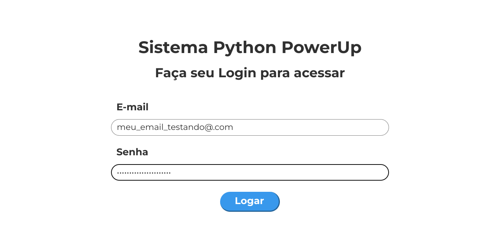

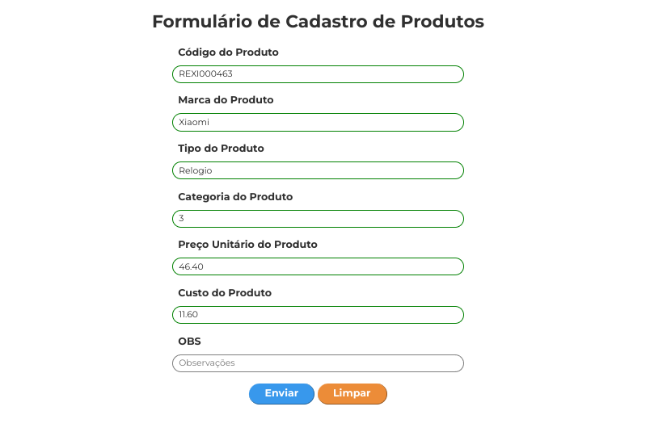

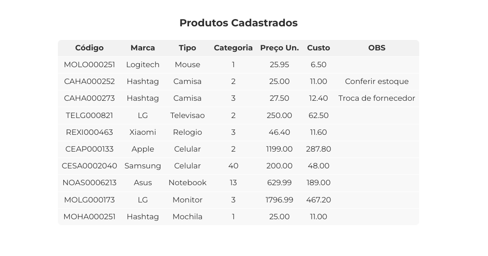

### 2. Projeto de Análise de Dados
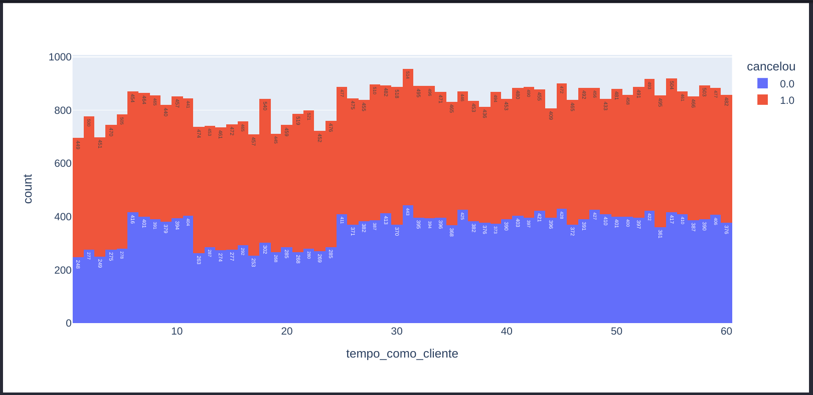

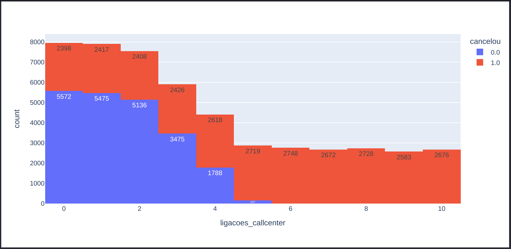

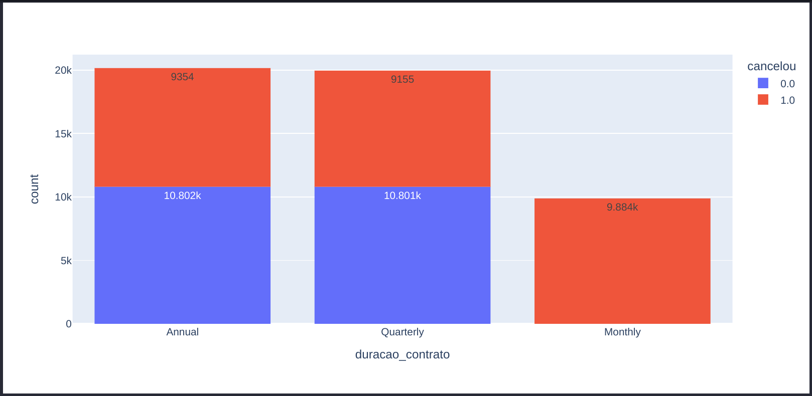

### 3. Projeto de Inteligência Artificial
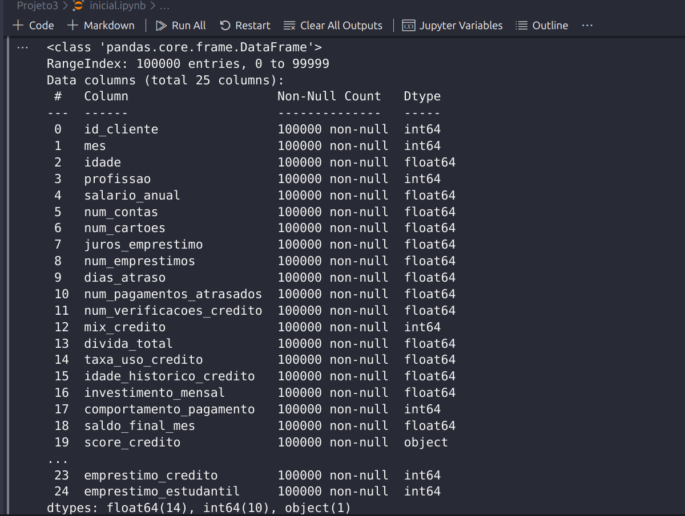

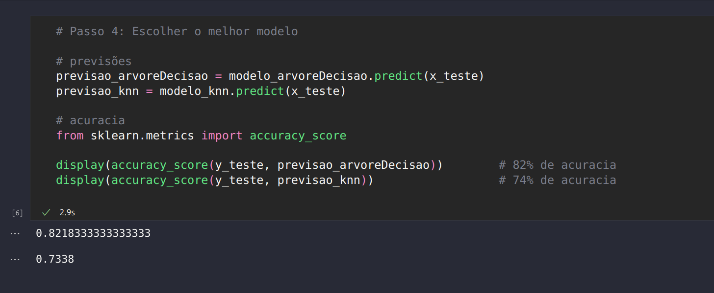

### 4. Projeto de Criação de Site/App
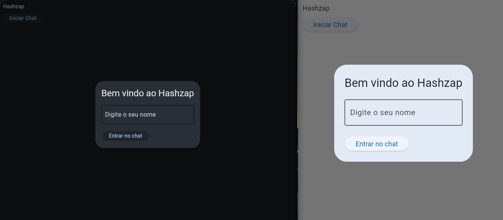

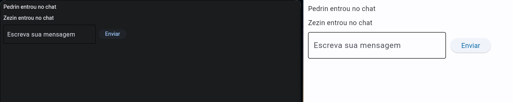

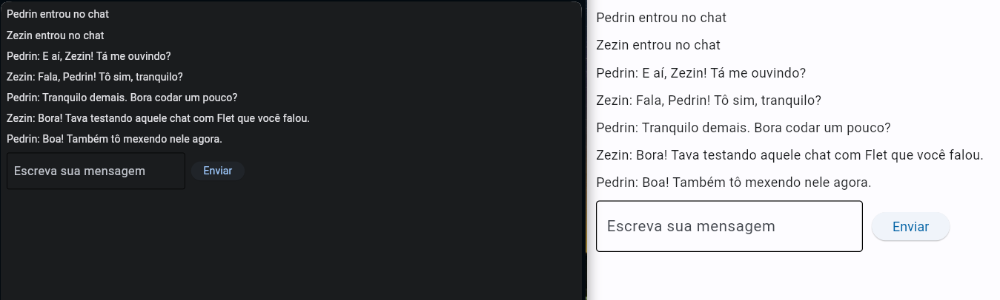
